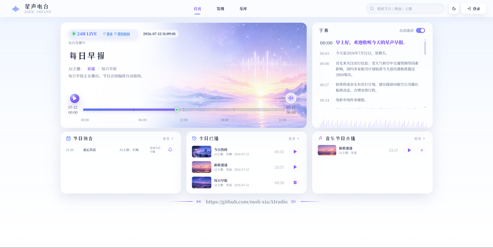
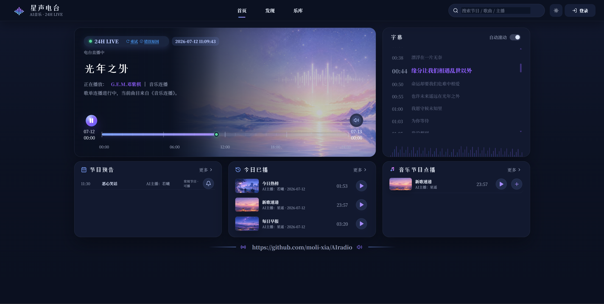
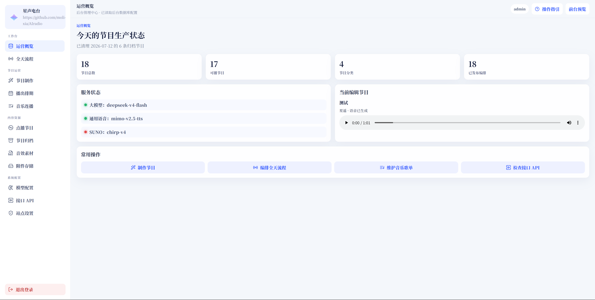

# AI Radio

AI Radio 是一个面向中文场景的 24 小时 AI 电台应用，包含前台播放页、后台节目管理、每日早报、今日热榜、AI 节目生成、TTS 配音、音乐连播与定时生成能力。

## 界面预览






## 功能概览

- 24 小时节目流：支持后台一键生成全天节目。
- 定时任务：可配置每天固定时间自动生成当天节目。
- 内容插件：每日早报、今日热榜、酷狗音乐、网易云音乐、QQ 音乐与自定义节目。
- AI 生成：调用 OpenAI 兼容大模型生成节目文案、音乐连播歌单及 Suno 歌曲提示词与歌词。
- AI 音乐：内置对本项目 `suno-api` 的调用，支持随机批量全自动创作、手动 Lyrics / Styles、男女声选择、Suno 双版本试听选择及生成音频本地归档。
- 网络媒体节目：支持直接音频、含音轨的视频文件、HLS 地址及 yt-dlp 可识别的播放页面，可自动解析 Bilibili 等站点、检测格式/时长、用 FFmpeg 本地提取音轨，并在播放前加入 AI 或原文介绍配音。
- TTS 配音：支持 OpenAI 兼容 TTS 接口。
- 生成进度：后台显示生成耗时、节点进度、当前处理节点、失败信息。
- 音乐连播补歌：AI 歌单支持分批生成，播放列表低于阈值时继续补充。
- 数据持久化：SQLite 数据库、音频文件、音效文件统一存储在运行时目录。

## Docker Hub 镜像

镜像仓库：

```bash
docker pull superneed/airadio:latest
```

该镜像支持：

- `linux/amd64`
- `linux/arm64`

## 使用 Docker 运行

创建数据目录：

```bash
mkdir -p ./airadio-data
```

启动容器：

```bash
docker run -d \
  --name airadio \
  --restart unless-stopped \
  -p 4177:4177 \
  -e TZ=Asia/Shanghai \
  -e AIRADIO_ADMIN_USER=admin \
  -e AIRADIO_ADMIN_PASSWORD='请改成强密码' \
  -v "$PWD/airadio-data:/data" \
  superneed/airadio:latest
```

容器启动时会自动创建并修正 `/data`、`/data/audio`、`/data/sound-effects` 的权限，因此可以直接使用宿主机目录挂载。

访问：

```text
http://localhost:4177
```

后台登录使用：

- 用户名：`AIRADIO_ADMIN_USER`
- 密码：`AIRADIO_ADMIN_PASSWORD`

`AIRADIO_ADMIN_PASSWORD` 必须显式设置，否则后台登录会被拒绝。

## 使用 Docker Compose 运行

复制环境变量示例：

```bash
cp .env.example .env
```

编辑 `.env`，至少修改：

```bash
AIRADIO_ADMIN_PASSWORD=请改成强密码
```

启动：

```bash
docker compose up -d
```

查看日志：

```bash
docker compose logs -f airadio
```

停止：

```bash
docker compose down
```

保留数据停止：

```bash
docker compose down
```

连同 Docker volume 一起删除：

```bash
docker compose down -v
```

## 本地构建 Docker 镜像

构建当前平台镜像：

```bash
docker build -t superneed/airadio:local .
```

运行本地构建镜像：

```bash
docker run --rm -p 4177:4177 \
  -e AIRADIO_ADMIN_PASSWORD='请改成强密码' \
  -v "$PWD/airadio-data:/data" \
  superneed/airadio:local
```

## 构建并推送多架构镜像

准备 buildx：

```bash
docker buildx create --name airadio-builder --use
docker buildx inspect --bootstrap
```

登录 Docker Hub：

```bash
docker login
```

构建并推送 `amd64` 和 `arm64`：

```bash
docker buildx build \
  --platform linux/amd64,linux/arm64 \
  -t superneed/airadio:latest \
  -t superneed/airadio:0.1.1 \
  --push .
```

查看镜像架构：

```bash
docker buildx imagetools inspect superneed/airadio:latest
```

## 环境变量

| 变量 | 默认值 | 说明 |
| --- | --- | --- |
| `NODE_ENV` | `production` | Node 运行模式 |
| `TZ` | `Asia/Shanghai` | 应用墙上时间，建议保持中国时区 |
| `AIRADIO_API_HOST` | `0.0.0.0` | HTTP 监听地址 |
| `AIRADIO_API_PORT` | `4177` | HTTP 监听端口 |
| `AIRADIO_STORAGE_DIR` | `./server/storage`（本地）/ `/data`（Docker） | SQLite、音频、音效等运行时数据目录；运行服务的用户必须拥有写权限 |
| `AIRADIO_ADMIN_USER` | `admin` | 后台管理员用户名 |
| `AIRADIO_ADMIN_PASSWORD` | 无 | 后台管理员密码，必须设置 |
| `KUGOU_WX_APPID` | 空 | 可选，酷狗微信登录相关配置 |
| `KUGOU_WX_LITE_APPID` | 空 | 可选，酷狗概念版微信登录相关配置 |
| `KUGOU_WX_SECRET` | 空 | 可选，酷狗微信登录 secret |
| `KUGOU_WX_LITE_SECRET` | 空 | 可选，酷狗概念版微信登录 secret |

## 后台 API 配置

应用不会在源码或镜像中内置大模型、TTS、ALAPI、Suno、酷狗、网易云或 QQ 音乐 Cookie 等密钥。

首次启动后进入后台，在配置页面填写：

- 大模型 API Key、Base URL、模型名。
- TTS API Key、Base URL、模型名和音色。
- 每日早报 / 今日热榜 token。
- 酷狗、网易云或 QQ 音乐 Cookie / 登录信息。
- Suno Cookie、本地 `suno-api` 地址和模型版本；自动模式会为付费账号选择 v5.5，为免费账号选择 v4.5。Suno 触发 hCaptcha 时还需要填写 2Captcha API Key。

这些配置会写入运行时 SQLite 数据库。Docker 部署时请持久化 `/data`，否则容器重建后配置和生成的音频会丢失。

Suno Cookie 获取方法：登录 [Suno](https://suno.com/)，按 `F12` 打开浏览器开发者工具，在 Network 中找到 `client?__clerk_api_version=2025-11-10&_clerk_js_version=5.117.0` 请求。优先复制 Request Headers 中的完整 `Cookie`；也可以复制响应里的四段 `Set-Cookie`，后台会自动合并并去除 `Path`、`Secure`、`SameSite` 等属性。最终 Cookie 必须包含 `__client`。Cookie 属于账号凭证，请勿提交到代码仓库或发送给他人；过期后需要重新获取。

Suno 当前会在歌曲生成时要求 hCaptcha token。项目内的 `suno-api` 使用 2Captcha 完成挑战，因此还需在“模型配置 → 本地 suno-api”填写有效且有余额的 2Captcha API Key。Suno 订阅额度与 2Captcha 余额是两个独立账户。

## 本地开发

安装依赖：

```bash
npm install
npm run install:music-apis
npm run install:suno-api
npm run build:suno-api
```

第二条命令安装项目内 `NeteaseCloudMusicApi` 与 `QQMusicApi` 的运行依赖，后两条命令安装本地 `suno-api`、下载它所需的固定版本 Chromium 并完成构建。浏览器保存在 `suno-api/.playwright-browsers`，运行服务的用户必须有读取和执行权限。后台“接口 API”负责三种音乐接口的启停和 Cookie；节目来源、选歌类型、数量、主播与串场设置在“节目制作”维护。

创建本地环境变量：

```bash
cp .env.example .env
```

启动前端和后端：

```bash
npm run dev:full
```

只启动后端：

```bash
npm run dev:api
```

构建生产前端：

```bash
npm run build
```

生产启动：

```bash
AIRADIO_ADMIN_PASSWORD='请改成强密码' npm run start
```

网络媒体节目需要系统安装 `ffmpeg`、`ffprobe` 和最新版本的 `yt-dlp`。Debian / Ubuntu 可执行：

```bash
sudo apt-get install ffmpeg
sudo curl -L --fail https://github.com/yt-dlp/yt-dlp/releases/latest/download/yt-dlp_linux -o /usr/local/bin/yt-dlp
sudo chmod 0755 /usr/local/bin/yt-dlp
```

Docker 镜像构建流程已自动安装 FFmpeg 和 yt-dlp。后台会先尝试直链探测，再使用 yt-dlp 解析播放页面；Bilibili 页面遇到 412 风控时会自动改用公开播放接口。较长媒体可使用“保存节目后台生成”，任务会立即入库并在服务端继续解析、下载和转码，节目状态会由“后台生成中”自动更新为“可播”或“生成失败”。需要登录的页面可以临时填写站点 Cookie，Cookie 不会写入节目或后台配置；DRM 内容仍不受支持。

另开一个进程启动本地 Suno 服务：

```bash
npm run start:suno-api
```

它默认只监听 `127.0.0.1:3010`。使用 systemd 部署时可参考 [deploy/airadio-suno.service](deploy/airadio-suno.service)，按实际项目目录和 Node 路径调整后启用。Suno 音乐生成依赖有效的 Suno 账号 Cookie 与可用额度；未配置 Cookie 时，其他节目制作功能不受影响。

## 数据目录

默认本地数据目录：

```text
server/storage/
```

Docker 数据目录：

```text
/data
```

目录内容包括：

- `airadio.sqlite`：配置、节目、预设、归档等数据。
- `audio/`：生成或上传的节目音频。
- `sound-effects/`：上传的音效文件。

这些文件包含运行时数据和可能的密钥配置，已经通过 `.gitignore` 和 `.dockerignore` 排除，不应提交到 Git 仓库或打进镜像。

## 安全说明

- 不要提交 `.env`、SQLite 数据库、音频存储目录或任何真实 API Key。
- 后台管理员密码必须通过环境变量设置。
- 公开部署时建议放在反向代理后，并启用 HTTPS。
- 如果使用 Docker Compose，`.env` 只用于本机部署，不应上传到公开仓库。

## GitHub

开源仓库：

```text
https://github.com/moli-xia/AIradio
```
